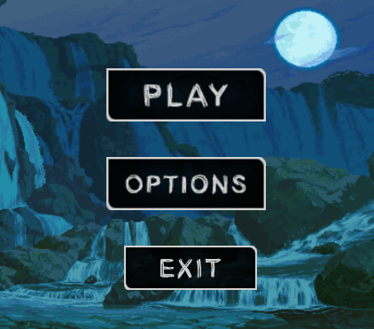

# Cave Explorer
Collect gems, don't fall, get rich. Cave-themed, visually aesthetic platformer.

<table>
  <tr>
    <td></td>
    <td></td>
    <td></td>
  </tr>
</table>

Made 4 years ago for a programming assignment. This was the first game (not on Scratch, that is) that I ever made, so I wouldn't be surprised if you find a bug or two. Produced in Java, Processing. There are only two levels, but they're cute ones!

I'm not particularly proud of my coding habits back in the day, just thought this was a cool showcase of my early computational art skills. However, this repo serves as a testament as to how much my coding habits have improved since I first picked up Java.

Find the Itch.io download page [here](https://joel-ca.itch.io/cave-explorer).
